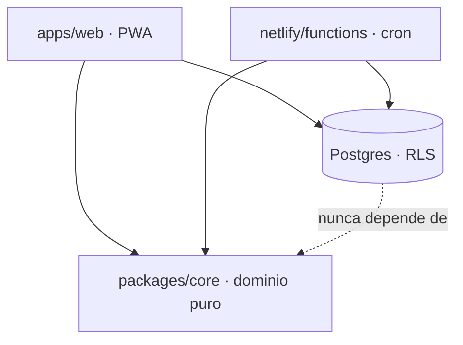
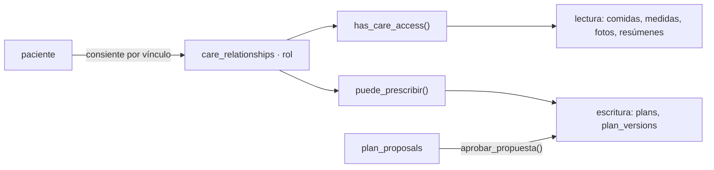
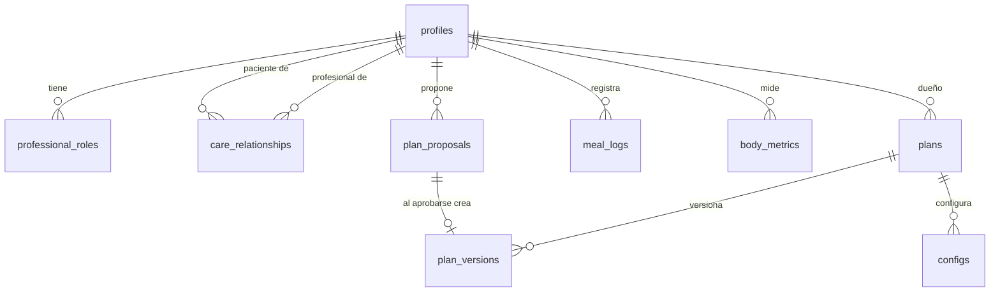

# Architecture Spine — En Punto, roles profesionales

## Design Paradigm

**Núcleo puro con autorización en el borde de datos.**

Tres anillos, y las dependencias solo apuntan hacia adentro:

- `packages/core` — dominio puro. Sin red, sin reloj, sin azar. Lo importan la PWA
  y el cron, y por eso pantalla y notificación nunca divergen.
- `apps/web` — presentación y adaptadores. No decide permisos: los pide.
- Postgres — **la única autoridad de autorización**. Ninguna decisión de permiso
  vive en el cliente, porque el cliente es código que corre en un teléfono ajeno.



## Inherited Invariants

Restricciones ya vigentes en el código. Read-only: un `AD` que las contradiga es un
conflicto a discutir, no una excepción local.

| Heredado | De | Ata acá |
| --- | --- | --- |
| Autorización solo en la base | 23 políticas RLS vigentes | Todo rol y vínculo nuevo se expresa en política, nunca en la UI |
| Núcleo puro y determinista | `packages/core` | Las métricas por rol se calculan ahí, no en la pantalla |
| Versiones de plan inmutables con autoría | `plan_versions` | Aprobar una propuesta inserta, nunca edita |
| Escritura verificada, sin éxito silencioso | `repositorio.ts` | Toda escritura nueva confirma que tocó una fila |

## Invariants & Rules

### AD-1 — Los roles viven en tabla propia, no en un arreglo

- **Binds:** FR-1..FR-5, toda política que distinga rol, el alta de profesional
- **Prevents:** que un nutricionista que además entrena no pueda tener una credencial
  por rol, y que el estado de verificación de matrícula no tenga dónde vivir
- **Rule:** `professional_roles(person, rol, matricula, jurisdiccion, estado, verificada_por, verificada_en)`,
  una fila por persona y rol. `profiles.is_professional` queda derivado y en desuso.
  Ninguna política lee un arreglo de roles.

### AD-2 — RLS es el piso; solo las transiciones multi-tabla se encapsulan

- **Binds:** FR-10..FR-13, toda escritura futura que cambie estado en dos tablas
- **Prevents:** una propuesta aprobada sin plan publicado —o al revés— por una
  conexión caída entre dos escrituras del cliente
- **Rule:** las escrituras simples pasan por política. Una transición que toca más de
  una tabla va en una función `SECURITY DEFINER` que verifica el rol adentro y corre
  en una transacción. La primera es `aprobar_propuesta(id, respuesta)`. Agregar una
  función para una escritura de una sola tabla está prohibido: parte la autoridad en
  dos lugares.

### AD-3 — Una fila por medida, con su origen

- **Binds:** FR-23..FR-27, toda lectura de progreso, toda fuente de medición futura
- **Prevents:** una migración por cada protocolo que traiga un profesional nuevo, y
  una tabla con veinte columnas nulas
- **Rule:** `body_metrics(patient_id, local_date, tipo, valor, unidad, origen, cargado_por)`.
  Ninguna lectura asume que existe una medida: se lee la serie del tipo pedido y se
  responde con lo que hay.
  - La lista blanca de `tipo` y `origen` tiene **un solo hogar**: se declara en
    `packages/core` y el `check` de SQL se genera desde ahí. Dos listas divergen el
    día que alguien agrega un pliegue en una sola.
  - La identidad de una medida es `(patient_id, local_date, tipo, origen)`. Sin
    `origen` en la clave, el pliegue que carga el entrenador pisa en silencio la
    lectura de balanza del paciente del mismo día.

### AD-4 — El acceso de prueba no existe en producción

- **Binds:** FR-28..FR-31
- **Prevents:** que una bandera mal configurada abra una puerta de autenticación en el
  sitio real
- **Rule:** el formulario de email y contraseña se compila solo con
  `VITE_LOGIN_PRUEBA` encendida, y esa bandera se pone únicamente en despliegues de
  vista previa. No hay bandera de servidor ni ruta secreta. La sesión que emite es
  real: mismo JWT, mismas políticas, ningún camino que saltee la autenticación.

### AD-5 — Ver y prescribir son dos permisos distintos

- **Binds:** FR-6..FR-15, todas las políticas de lectura y escritura clínica
- **Prevents:** que sumar un rol que solo observa habilite, por omisión, publicar un
  plan de alimentación
- **Rule:** `has_care_access(patient)` gobierna lectura y sigue valiendo para cualquier
  rol vinculado y consentido. `puede_prescribir(patient)` es nueva, exige rol
  `nutricionista`, y es la única puerta de escritura de `plans` y `plan_versions`.
  Toda tabla clínica nueva declara con cuál de las dos se lee y se escribe.

### AD-6 — Una propuesta es privada entre quien la escribe y quien la decide

- **Binds:** FR-11..FR-13
- **Prevents:** que un profesional lea las propuestas de otro sobre el mismo paciente,
  o que el paciente vea un cambio de plan que todavía no rige y lo tome por indicación
- **Rule:** una fila de `plan_proposals` la leen su autor y quien puede prescribir para
  ese paciente. Nadie más, el paciente incluido. Al aprobarse, lo que el paciente ve es
  la versión publicada, nunca la propuesta.



## Consistency Conventions

| Concern | Convención |
| --- | --- |
| Nombres | Tablas e identificadores en inglés (sigue lo existente); comentarios, tests y documentos en español |
| Datos y formatos | Fechas locales como `date`, nunca timestamp, porque el día es el del paciente y no el de UTC. Ids `uuid`. Enumerados como `text` con `check`, no como tipo enum: agregar un valor no debe requerir migración de tipo |
| Estado y transversales | Escritura optimista con reversa en la UI; toda escritura confirma que tocó una fila. Errores con mensaje accionable en español. Ninguna clave de servicio en el bundle: hay un guardia de build |
| Autorización | Toda tabla nueva nace con RLS habilitada y su política en el mismo archivo que la crea. Una vista lleva `security_invoker = true` o filtra los datos de todos |
| Pruebas | Toda política nueva suma una aserción al arnés de `supabase/test`. Toda regla de dominio suma un test en `packages/core` |

## Stack

Verificado contra el repositorio, no de memoria.

| Nombre | Versión |
| --- | --- |
| Node | >= 22.6 |
| TypeScript sin compilar | `--experimental-strip-types` |
| React | ^18.3.1 |
| Vite | ^6.0.0 |
| supabase-js | ^2.45.0 |
| Postgres (arnés de pruebas) | 16 |
| Netlify | hosting y cron |

## Structural Seed



```text
packages/core/src/
  reglas.ts        # las reglas del plan, vivas
  progreso.ts      # tendencias; pasa a leer body_metrics por tipo
  consulta.ts      # resumen para la nutricionista
  entrenador.ts    # NUEVO: la lectura de resultado y el cruce adherencia x cambio
apps/web/src/
  pantallas/       # una por superficie de la IA
  lib/repositorio.ts  # única puerta de datos
supabase/
  schema.sql       # estado actual completo
  migraciones/     # cambios sobre una base ya creada
  test/            # aserciones de permisos
```

**Entornos.** Producción en Netlify sobre la rama principal, sin `VITE_LOGIN_PRUEBA`.
Vista previa por rama, con la bandera encendida y datos sembrados. Una sola base
Supabase para ambos: las cuentas de prueba viven ahí marcadas con `es_prueba` y
vinculadas solo entre ellas, que es lo que hace tolerable compartir proyecto.

## Capability → Architecture Map

| Área | Vive en | Gobernada por |
| --- | --- | --- |
| Roles y matrícula | `professional_roles` | AD-1 |
| Vínculos y consentimiento | `care_relationships.rol` | AD-5, heredado de consentimiento |
| Propuestas de plan | `plan_proposals` + `aprobar_propuesta()` | AD-2, AD-5, AD-6 |
| Vista de nutricionista | `consulta.ts` | núcleo puro |
| Vista de entrenador | `entrenador.ts` | núcleo puro, AD-3 |
| Composición corporal | `body_metrics` | AD-3 |
| Acceso de prueba | build de vista previa | AD-4 |

## Deferred

- **Módulo de entrenamiento** (rutinas, series, sesiones). Es otro producto; primero
  se valida el rol.
- **Cobros y límites por plan.** Sin definir quién paga; nada del épico lo necesita.
- **Verificación automática de matrícula.** La manual alcanza para el primer tramo.
- **Multi-tenant por esquema.** Hoy es RLS sobre una base y nada en este épico lo
  fuerza a cambiar. Se revisa si aparece un cliente que exija aislamiento físico.
- **Presentación de series con fuentes mezcladas.** AD-3 garantiza que el origen está
  guardado; cómo se dibuja lo decide UX.
- **Dos nutricionistas sobre el mismo paciente.** Hoy gana la última publicación,
  auditado y sin guardas. Se decide cuando exista el caso real.
- **Herencia de planes de un profesional que se va.** Sin caso todavía.
